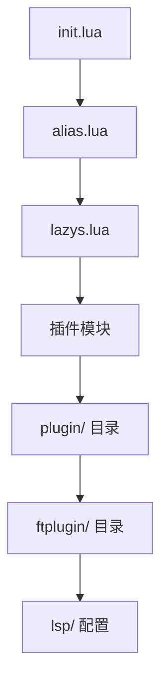

# 📖 Neovim 配置完整指南

这是一个全面的 Neovim 配置使用和自定义指南，帮助你充分利用这个配置的所有功能。

## 📚 目录

- [快速开始](#-快速开始)
- [配置结构](#-配置结构)
- [核心功能](#-核心功能)
- [自定义配置](#-自定义配置)
- [性能优化](#-性能优化)
- [故障排除](#-故障排除)
- [进阶使用](#-进阶使用)

## 🚀 快速开始

### 系统要求
- **Neovim** >= 0.9.0
- **Git** (用于插件管理)
- **Node.js** (用于某些 LSP 服务器)
- **Python** (可选，用于某些插件)
- **ripgrep** (用于搜索功能)
- **fd** (用于文件查找)

### 安装步骤

1. **备份现有配置**
```bash
mv ~/.config/nvim ~/.config/nvim.backup
```

2. **克隆配置**
```bash
git clone <your-repo> ~/.config/nvim
cd ~/.config/nvim
```

3. **首次启动**
```bash
nvim
```

4. **等待插件安装完成**
   - lazy.nvim 会自动安装所有插件
   - 可能需要几分钟时间
   - 安装完成后重启 Neovim

5. **健康检查**
```bash
:checkhealth
```

## 🏗️ 配置结构

```
nvim/
├── init.lua                    # 入口文件
├── lua/                        # Lua 配置目录
│   ├── alias.lua              # 全局工具函数
│   ├── lazys.lua              # 插件管理器配置
│   ├── ui/                    # 用户界面模块
│   ├── cmp/                   # 代码补全模块
│   ├── lsp/                   # 语言服务器模块
│   ├── git/                   # Git 集成模块
│   ├── text/                  # 文本处理模块
│   ├── vim/                   # Vim 增强模块
│   ├── bookmark/              # 书签模块
│   ├── components/            # 通用组件模块
│   └── utils/                 # 工具函数库
├── plugin/                     # 自动加载配置
├── ftplugin/                   # 文件类型配置
├── lsp/                        # LSP 服务器配置
└── docs/                       # 文档目录
```

### 配置加载流程



## ⚡ 核心功能

### 🎨 用户界面
- **主题**: Tokyo Night (moon 风格)
- **状态栏**: 自定义状态栏显示文件信息、Git 状态、LSP 状态
- **标签页**: BufferLine 美观的缓冲区管理
- **文件树**: Neo-tree 现代文件浏览器
- **通知**: 美观的通知系统

### 💬 代码补全
- **引擎**: nvim-cmp 智能补全
- **源**: LSP、缓冲区、路径、代码片段
- **片段**: LuaSnip 强大的代码片段系统
- **UI**: lspkind 图标美化

### 🔍 语言支持
- **Go**: 完整的 LSP + 专用工具
- **TypeScript/JavaScript**: 类型检查和智能重构
- **Python**: Pyright 类型检查
- **Rust**: rust-analyzer 支持
- **C/C++**: Clangd 集成
- **Lua**: Neovim 配置开发支持

### 🌿 Git 集成
- **状态显示**: Gitsigns 行级变更标记
- **界面**: LazyGit 全功能 Git TUI
- **差异查看**: Diffview 可视化差异
- **历史**: 完整的 Git 历史浏览

### 🔍 搜索和导航
- **模糊搜索**: Telescope 强大的搜索器
- **快速跳转**: Flash 双字符跳转
- **书签**: 文件和行级书签系统
- **标记**: 增强的 Vim 标记系统

## 🔧 自定义配置

### 添加新插件

1. **选择合适的模块目录**
```bash
# 例如添加 UI 插件
cd lua/ui/
```

2. **编辑 plugins.lua**
```lua
-- lua/ui/plugins.lua
M.list = {
  -- 现有插件...
  
  -- 添加新插件
  {
    "author/plugin-name",
    event = "VeryLazy",
    config = function()
      require("plugin-name").setup({
        -- 插件配置
      })
    end,
  },
}
```

3. **重启 Neovim**
```bash
:Lazy sync
```

### 修改键位映射

1. **全局键位**: 编辑 `plugin/keymaps.lua`
```lua
-- plugin/keymaps.lua
nmap("<leader>x", ":YourCommand<CR>")
```

2. **插件特定键位**: 在插件配置中添加
```lua
{
  "plugin-name",
  keys = {
    { "<leader>p", ":PluginCommand<CR>", desc = "Plugin action" },
  },
}
```

3. **文件类型键位**: 编辑 `ftplugin/{filetype}.lua`
```lua
-- ftplugin/python.lua
local map = vim.keymap.set
map("n", "<F5>", ":!python %<CR>", { buffer = true })
```

### 调整编辑器选项

编辑 `plugin/option.lua`:
```lua
-- plugin/option.lua
local options = {
  -- 修改现有选项
  tabstop = 2,              -- 改为 2 空格
  updatetime = 250,         -- 调整更新时间
  
  -- 添加新选项
  your_option = "value",
}
```

### 自定义主题

1. **切换主题**
```lua
-- 在 init.lua 中修改
local colors = {
  theme = "catppuccin",     -- 改为其他主题
}
```

2. **自定义颜色**
```lua
-- 添加自定义高亮
vim.api.nvim_set_hl(0, "YourHighlight", {
  fg = "#ff0000",
  bg = "#000000",
})
```

## 🚀 性能优化

### 启动时间优化

1. **检查启动时间**
```bash
nvim --startuptime startup.log
```

2. **优化插件加载**
```lua
-- 使用更精确的懒加载
{
  "plugin-name",
  event = "BufReadPost",    -- 而不是 "VeryLazy"
  ft = { "specific-type" }, -- 限制文件类型
}
```

3. **禁用不需要的插件**
```lua
-- 在插件配置中添加
{
  "plugin-name",
  enabled = false,          -- 禁用插件
}
```

### 内存使用优化

1. **调整 updatetime**
```lua
-- plugin/option.lua
updatetime = 250,           -- 从 100 增加到 250
```

2. **限制补全项数量**
```lua
-- lua/cmp/cmp.lua
completion = {
  max_item_count = 20,      -- 限制补全项
}
```

3. **优化 Tree-sitter**
```lua
-- lua/text/treesitter.lua
disable = function(lang, buf)
  local max_filesize = 100 * 1024 -- 100 KB
  local ok, stats = pcall(vim.loop.fs_stat, vim.api.nvim_buf_get_name(buf))
  if ok and stats and stats.size > max_filesize then
    return true
  end
end
```

## 🐛 故障排除

### 常见问题

#### 1. 插件加载失败
```bash
# 检查插件状态
:Lazy

# 同步插件
:Lazy sync

# 清理并重装
:Lazy clean
:Lazy install
```

#### 2. LSP 不工作
```bash
# 检查 LSP 状态
:LspInfo

# 检查健康状态
:checkhealth lsp

# 重启 LSP
:LspRestart
```

#### 3. 键位不工作
```bash
# 检查键位映射
:map <key>

# 查看映射来源
:verbose map <key>
```

#### 4. 配置不生效
```bash
# 检查错误信息
:messages

# 重新加载配置
:source $MYVIMRC
```

### 调试技巧

1. **开启调试模式**
```lua
vim.g.debug_mode = true
```

2. **查看加载的模块**
```lua
:lua print(vim.inspect(package.loaded))
```

3. **检查配置值**
```lua
:lua print(vim.inspect(vim.opt.tabstop:get()))
```

4. **性能分析**
```bash
# 启动时性能分析
PROF=1 nvim

# 插件性能分析
:Lazy profile
```

## 🎓 进阶使用

### 项目特定配置

1. **创建项目配置文件**
```lua
-- .nvim.lua (在项目根目录)
-- 项目特定的 Neovim 配置

-- LSP 设置
vim.lsp.set_log_level("debug")

-- 项目特定键位
vim.keymap.set("n", "<leader>pt", ":ProjectTest<CR>")

-- 环境变量
vim.env.PROJECT_ROOT = vim.fn.getcwd()
```

2. **条件配置**
```lua
-- 根据项目类型调整配置
if vim.fn.filereadable("package.json") == 1 then
  -- Node.js 项目配置
  vim.opt.tabstop = 2
elseif vim.fn.filereadable("go.mod") == 1 then
  -- Go 项目配置
  vim.opt.expandtab = false
end
```

### 自定义命令

```lua
-- plugin/commands.lua
-- 创建自定义命令

-- 项目搜索
vim.api.nvim_create_user_command("ProjectGrep", function(opts)
  require("telescope.builtin").live_grep({
    search_dirs = { vim.fn.getcwd() },
    additional_args = function()
      return { "--hidden" }
    end,
  })
end, {})

-- 配置重载
vim.api.nvim_create_user_command("ReloadConfig", function()
  for name, _ in pairs(package.loaded) do
    if name:match("^lua/") then
      package.loaded[name] = nil
    end
  end
  dofile(vim.env.MYVIMRC)
  vim.notify("配置已重新加载", vim.log.levels.INFO)
end, {})
```

### 工作流自动化

```lua
-- plugin/workflow.lua
-- 自动化工作流

-- 自动保存和格式化
vim.api.nvim_create_autocmd("BufWritePre", {
  pattern = { "*.go", "*.lua", "*.js", "*.ts" },
  callback = function()
    vim.lsp.buf.format()
  end,
})

-- 项目会话管理
vim.api.nvim_create_autocmd("VimEnter", {
  callback = function()
    if vim.fn.argc() == 0 then
      -- 自动加载项目会话
      local session_file = vim.fn.getcwd() .. "/.nvim-session"
      if vim.fn.filereadable(session_file) == 1 then
        vim.cmd("source " .. session_file)
      end
    end
  end,
})
```

### 插件开发

```lua
-- lua/custom/my-plugin.lua
-- 自定义插件示例

local M = {}

function M.setup(opts)
  opts = opts or {}
  
  -- 插件初始化逻辑
  vim.api.nvim_create_user_command("MyCommand", function()
    print("Hello from my plugin!")
  end, {})
  
  -- 键位映射
  if opts.keymaps then
    vim.keymap.set("n", "<leader>mp", ":MyCommand<CR>")
  end
end

return M
```

## 📚 学习资源

### 官方文档
- [Neovim 用户手册](https://neovim.io/doc/user/)
- [Lua 指南](https://neovim.io/doc/user/lua-guide.html)
- [LSP 配置](https://github.com/neovim/nvim-lspconfig)

### 社区资源
- [awesome-neovim](https://github.com/rockerBOO/awesome-neovim)
- [Neovim Discourse](https://neovim.discourse.group/)
- [r/neovim](https://www.reddit.com/r/neovim/)

### 配置示例
- [LazyVim](https://github.com/LazyVim/LazyVim)
- [AstroNvim](https://github.com/AstroNvim/AstroNvim)
- [NvChad](https://github.com/NvChad/NvChad)

## 🤝 贡献指南

### 报告问题
1. 检查现有 Issues
2. 提供详细的错误信息
3. 包含系统信息和配置版本
4. 提供重现步骤

### 提交改进
1. Fork 项目
2. 创建功能分支
3. 编写清晰的提交信息
4. 提交 Pull Request
5. 更新相关文档

### 代码规范
- 使用 stylua 格式化 Lua 代码
- 添加适当的注释和文档
- 遵循现有的代码风格
- 确保配置的向后兼容性

---

📖 **提示**: 这个配置是一个起点，鼓励你根据自己的需求进行定制和扩展。记住，最好的配置是适合你工作流程的配置！